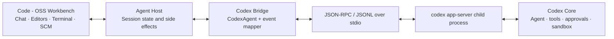

# Architecture

## Audited upstream baseline

The current Code - OSS checkout already contains the correct foundation for a
deep Codex integration:

- `src/vs/platform/agentHost/node/codex/codexAgent.ts` owns Codex lifecycle,
  authentication, thread/turn operations, model configuration, approvals,
  skills, plugins, MCP, memory-oriented events, subagents, usage, and process
  launch.
- `codexAppServerClient.ts` implements the official JSON-RPC-over-stdio client.
- `codexMapAppServerEvents.ts` maps public app-server notifications into Agent
  Host state actions.
- `protocol/generated` is generated from the pinned `@openai/codex` app-server
  schema. Generated files remain untouched and are refreshed with the upstream
  generation/check scripts.
- `src/vs/sessions` and the workbench chat contributions provide native session
  history, chat, tool-call cards, approvals, Changes, Multi Diff, checkpoints,
  Accept/Reject/Revert, model selection, and token/context UI.

The Codex checkout supplies the other half:

- `codex-rs/app-server` is the child-process server.
- `codex-rs/app-server-protocol` is the canonical protocol and schema source.
- `codex-rs/core` owns agent execution, tools, permissions, sandbox policy,
  skills, MCP, memory, and collaboration/subagent behavior.
- `codex-rs/cli` builds the `codex` executable whose `app-server` subcommand is
  launched by Forge.

This means Forge is an upstream-friendly product layer, not a second agent
runtime.

## Runtime topology

One shared app-server process hosts multiple Codex threads. Workbench sessions
retain native Code - OSS identities while the bridge keeps the mapping to
Codex thread and turn IDs. Subagent threads are routed into child conversations
without inventing a separate protocol.

## Workbench shell

Forge starts in the normal Code - OSS workbench rather than the separate
Sessions window. A workbench contribution covers the restoring UI with the
Forge agent-icon animation for at least one second, waits for the Codex Agent
Host contribution, opens Codex in the native Chat view, and only then removes
the cover. The editor remains the main pane and Codex remains an independently
resizable side pane, so agent activity never replaces or obscures source code.

New side-bar and editor chats default to the `agent-host-codex` harness. The
former Agents-window actions are retained as compatibility command IDs, but
now open the native Codex settings GUI; they no longer switch the product into
a second chat-centric shell.

## Event routing

| App-server surface | Forge/Code - OSS destination |
| --- | --- |
| `item/agentMessage/delta` | native chat markdown stream |
| reasoning summary/status notifications | public reasoning/status parts only |
| command output deltas | native tool card output, status, exit result |
| MCP/dynamic tool progress | tool cards and MCP customization surfaces |
| `item/fileChange/patchUpdated` | tool summary plus DB-backed native `FileEdit` snapshots |
| `turn/diff/updated` | cumulative-diff fallback for app-server tracked edits |
| shell command start/completion | bounded before/after snapshots for direct shell writes |
| command/file/permission approval requests | native confirmation UI; response returned to Codex |
| turn token-usage updates | session usage/context indicators |
| thread list/read/resume/fork | native session history and recovery |
| `error` with retry state | native retry activity or terminal chat error |

Hidden chain-of-thought is never reconstructed. The UI renders only the
reasoning summary, status, and related events actually published by app-server.

Forge launches app-server with an isolated Codex home (`~/.forge/codex` by
default). A one-time migration copies portable authentication and configuration
only; versioned caches and databases remain owned by the exact Codex runtime
that created them.

## Multi-agent orchestration

Forge can schedule a Codex Leader plus parallel Workers without adding extra
chats. The host-owned `ForgeOrchestrationService` talks to `ILeaderProvider` /
`IWorkerProvider` adapters. DeepSeek Harness and Grok Build run as subprocesses;
the workspace is the shared artifact layer. Design, interfaces, UI, and the
phase-1 vertical slice are in `docs/FORGE-ORCHESTRATION.md`.

## Streaming diff design

The upstream mapper previously converted `fileChange/patchUpdated` only into a
text summary. Forge adds a narrow `CodexFileEditObserver` adapter:

1. Capture each file's original content once when the file-change item starts.
2. Convert every public `FileUpdateChange` update into an in-memory right-hand
   preview, **fail-closed**. Adds and deletes are direct; updates apply Codex's
   unified diff to the stable baseline. Context and deleted lines must match the
   baseline byte-for-byte after CRLF normalization. Any hunk mismatch, a missing
   hunk, or an on-disk conflict with the captured baseline refuses the preview
   instead of guessing the after-state.
3. Persist before/after snapshots through the shared `FileEditTracker` and
   session database. Create/delete/rename/move use first-class identities
   (`omitBefore`, `omitAfter`, distinct after URI) so `normalizeFileEdit` can
   classify them. Binary and oversized shell snapshots are skipped, not shown as
   empty text files.
4. Add structured `FileEdit` content to the existing tool-call update only when
   reconstruction succeeded. Each in-flight after-snapshot carries a monotonic
   URI revision so equal-size text updates cannot be collapsed by observable
   equality. If reconstruction failed, the tool card keeps a text notice:
   live preview is unavailable and the final disk snapshot appears on completion.
5. The shared `LiveEditPreviewController` opens a native two-pane Diff Editor
   only for a trustworthy snapshot. `unavailable` updates never open a right-hand
   model. The first file in a context may take focus; later deltas use
   `preserveFocus`. Both the regular Codex side-bar chat and the legacy Sessions
   surface feed the same controller. Forge adapts Cline's Apache-2.0 EditPreview
   sweep: unchanged runs zip past, changed runs appear line by line, a yellow
   active-line/faded-tail overlay marks progress, and the editor follows the
   cursor. New Codex snapshots interrupt the prior sweep and continue from the
   visible state, while the workspace file remains under Codex Core's normal
   approval and sandbox flow.
6. Fallback order is strict patch reconstruction, then `turn/diff/updated`
   cumulative diff (also fail-closed when inverted hunks do not apply), then the
   completion disk snapshot. On successful completion, open the actual on-disk
   file in the same editor group first, then close the exact virtual Diff input.
   The comparison tab does not accumulate or remain as a post-edit preview; only
   the normal file editor remains. Canceled/rejected turns use the
   response-completion fallback to close any unfinished preview as well.

Forge also appends a narrow runtime instruction asking Codex to use its native
`apply_patch` tool for source/text edits, which preserves true patch streaming.
This is not treated as the only guarantee: commands that still write through
PowerShell, shell redirection, or scripts enter the same serialized file-event
queue. Before execution, the bridge snapshots exact command-referenced paths
and a bounded small-workspace set (large generated/dependency directories are
excluded, empty text files are included, binaries and files over 2 MiB skip
content); after execution, changed before/after pairs become normal
DB-backed `FileEdit` content on the shell tool result. The editor then opens
and performs the same line-by-line, auto-scrolling playback. Official
`turn/diff/updated` notifications provide an additional cumulative-diff path
for changes tracked by Codex Core.

The adapter never writes a preview into the workspace and never approves a
change. Codex applies files only after its own approval/sandbox flow permits it.
Asynchronous file events are serialized per Codex thread so `item/completed`
and `turn/completed` cannot overtake a pending snapshot.

Forge enables Codex Core's `features.apply_patch_streaming_events` both at
app-server launch and for thread start, resume, and fork. This is deliberately
redundant: a user config or a restored thread cannot silently fall back to the
completion-only edit experience.

## Upstream synchronization rules

- Do not edit generated Codex protocol files.
- Keep Forge-specific runtime code beside the existing Codex bridge and shared
  Agent Host abstractions.
- Prefer default configuration/product changes over forks of workbench UI.
- Do not rewrite published `main` history to restore Code-OSS ancestry. Replay
  Forge changes with `docs/FORGE-DELTA.md` and `scripts/forge/compare-upstream.ps1`.
- Record each upstream sync in `docs/UPSTREAM-SYNC-LOG.md`.
- If app-server changes `FileUpdateChange`, update the observer and its tests,
  then regenerate the pinned protocol through Code - OSS's official script.
