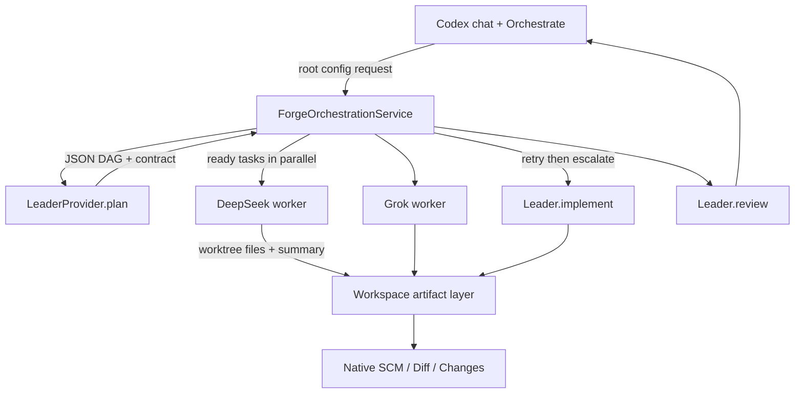

# Forge Multi-Agent Orchestration

Forge is no longer a single Codex chat. It can schedule a Leader plus parallel
Workers on top of the existing Agent Host, Session, FileEdit, Changes, Multi Diff,
approvals, and worktree machinery.

## Architecture judgment

I compared two designs against the actual trees:

| | A. Host orchestrator + adapters | B. Register DeepSeek / Grok as full `IAgent` providers |
| --- | --- | --- |
| Complexity | Small Forge delta. Workers are subprocess adapters. | Large: session catalog, FileEdit, approvals, restore for each runtime |
| Reliability | One scheduler, structured artifacts, workspace as the shared layer | Three session graphs that still need a coordinator |
| Upstream | Does not fork Agent Host or CodexAgent | Touches provider registration and Copilot-shaped seams |
| Maintenance | New runtime = new `IWorkerProvider` | New runtime = new Agent Host provider |

**Chosen: A.** Forge already has a Codex-only Agent Host. DeepSeek Harness is a
one-shot `dsh --profile headless "task"` process. Grok Build is `grok -p … --yolo
--output-format json`. Neither is an Agent Host provider, and wiring them as such
would block the vertical slice.

Rejected for this phase: a full ACP client. Neither sibling tree is the Forge
session runtime; both are executed through adapters.

Vendored source (inside this repo):

- `third_party/deepseek-harness`
- `third_party/grok-build`

Default assignment (UI-overridable; any catalog agent can be Leader or Worker):

- Leader: Codex / `gpt-5.6-sol`
- Workers: DeepSeek Harness / `deepseek-v4-flash`, Grok Build / `grok-4.6`

The picker lists Codex, DeepSeek Harness, and Grok Build for both roles. GPT-5.6
Luna is not in the Grok tree. Grok’s model string can be changed in the
assignment; a custom `[model.*]` in `~/.grok/config.toml` is required for names
the binary does not ship.

## Key interfaces

`src/vs/platform/agentHost/common/orchestration/orchestrationTypes.ts`

- `ILeaderProvider` — `plan` / `review` / `implement` (escalation only)
- `IWorkerProvider` — `isAvailable` / `run`
- `IOrchestrationPlan` / task DAG
- `IWorkerTaskResult` — status, files, tests, risk, usage; no transcript
- Root-config keys: `forge.orchestration.{state,request,command,assignment}`

Adapters:

- `CodexLeaderProvider` / `CodexWorkerProvider` with `LocalLeaderProvider` fallback
- `CliLeaderProvider` for DeepSeek Harness and Grok Build
- `DeepSeekHarnessWorker` / `GrokBuildWorker`

Scheduler: `ForgeOrchestrationService` in the Agent Host process.

## Data flow

Workers never send chat history back. The workspace (plus a short structured
summary) is the shared artifact. Parallel workers use git worktrees when the
folder is a repo, then copy changed files back. In-place fallback is used when
worktree creation fails.

Retry: one worker retry, then escalate to the Leader. Pause stops scheduling.
Cancel aborts the run.

## UI

The original model slot is the **work mode** picker (Logos / Dialectic), not
three chats. Logos puts a single model picker on the right, with a sliders
control beside the model name for thinking depth and context size. Dialectic
keeps Leader / Worker on the composer and the **编排** action. In Dialectic,
pressing **Enter** in the chat input starts orchestration the same way as the
**编排** button. Both the work mode and model configuration persist across restarts.

CLI workers resolve from in-tree `third_party/deepseek-harness` and
`third_party/grok-build` (walking up from `appRoot`), then `~/.dsh` / `~/.grok` /
`~/.forge/` install paths, then `npx` / `PATH` fallbacks. They require
`DEEPSEEK_API_KEY`, `XAI_API_KEY`, or saved credentials under `~/.dsh` /
`~/.grok`. When a CLI worker is unavailable, the scheduler falls back to Codex
for that task.

## Vertical slice

1. User types a goal and clicks 编排.
2. Leader plans (Codex when the session exists, otherwise the local two-task DAG).
3. At least two independent tasks run in parallel on DeepSeek and Grok.
4. Patches merge into the workspace.
5. Native SCM shows the diff.
6. Leader reviews structured summaries.
7. Failed workers retry once, then escalate.

## Tests

- `taskGraph.test.ts` — parse, parallel ready set, dependency blocking
- `orchestrator.test.ts` — two fake workers, escalation, cancel
- `workerAdapters.test.ts` — summary parse, API-key gating, prompt contract

Requires `DEEPSEEK_API_KEY` and `XAI_API_KEY` (or `GROK_CODE_XAI_API_KEY`) for
real worker processes. Missing keys fail the task and escalate to Codex.

## Upstream / Copilot

Orchestration is a Forge delta. Copilot Agent Host code stays on disk for
rebase. Forge still advertises only Codex. User-facing Copilot copy on Forge
welcome/onboarding/account surfaces is neutralized without deleting upstream
trees.
